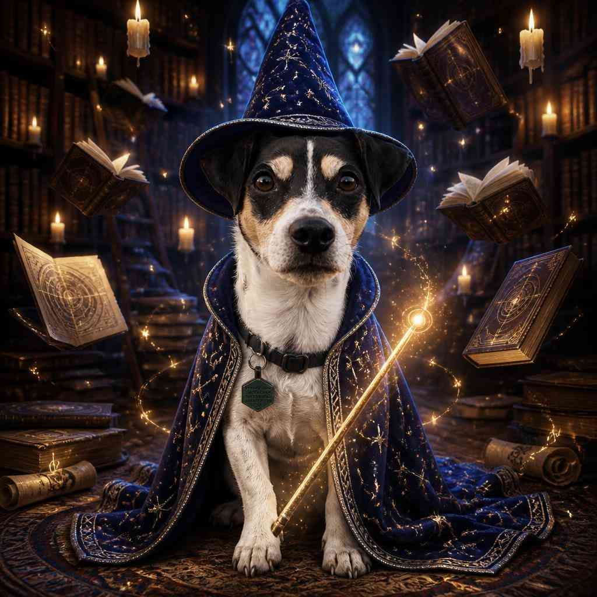
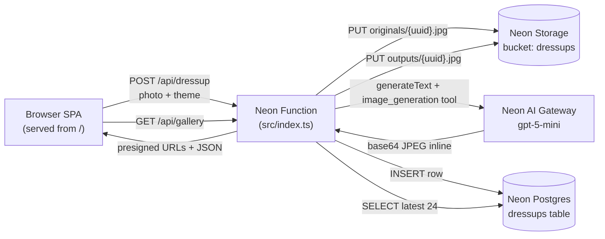

# 🐶 Doggo Dress-Up

Upload a photo of your dog, pick a costume, an AI agent re-imagines them — wizard, knight, astronaut, sushi chef, disco star, and more.

A tiny app built on the **Neon backend for apps and agents** private preview, using all three new primitives:

- **[Neon Functions](https://neon.com/docs/compute/functions/overview)** — long-running Node.js HTTP function next to the database
- **[Neon Object Storage](https://neon.com/docs/storage/overview)** — S3-compatible bucket for the original photo and the generated image, branched with the database
- **[Neon AI Gateway](https://neon.com/docs/ai-gateway/overview)** — one credential to call `gpt-5-mini` with the OpenAI Responses `image_generation` tool

…plus regular **Neon Postgres** for the gallery index.



> _Same dog. Same fur pattern. Same tag on the collar. Now a wizard._

## How it works



Every primitive lives on **one Neon project**, in one branch. Fork the branch and you get an isolated copy of the database, the storage, and the function — perfect for preview environments.

## Endpoints (the function is the whole app)

| Method | Path | What it does |
| ------ | ---- | ------------ |
| `GET`  | `/`            | Serves the single-page UI (HTML + CSS + vanilla JS) |
| `GET`  | `/api/themes`  | Lists the available costumes |
| `POST` | `/api/dressup` | `multipart/form-data`: `photo` (file) + `theme` (id). Uploads the photo, calls the model with the photo as a visual reference + the theme prompt, captures the generated JPEG, stores both in the bucket, inserts a row, returns presigned URLs. |
| `GET`  | `/api/gallery` | Latest 24 dress-ups with fresh presigned URLs. |

## Project layout

```
.
├── neon.ts            # IaC: enables AI Gateway, declares bucket + function
├── src/
│   ├── index.ts       # The function: routes + AI agent + S3 + Drizzle
│   ├── themes.ts      # Costumes (knight, astronaut, wizard, …)
│   ├── web.ts         # Inline HTML/CSS/JS for the SPA
│   └── db/schema.ts   # Drizzle schema for the dressups table
├── drizzle.config.ts
├── package.json
└── docs/wizard-dog.jpg
```

## Run it yourself

You need access to the Neon backend-for-apps-and-agents private preview. [Sign up here.](https://neon.com/blog/were-building-backends#access)

```bash
# 1. Scaffold from this repo
git clone https://github.com/<you>/doggo-dressup.git
cd doggo-dressup
npm install

# 2. Create a NEW Neon project in aws-us-east-2 and link to it
neon login
neon link --project-name doggo-dressup --region-id aws-us-east-2

# 3. Provision the bucket + AI Gateway + deploy the function
neon deploy

# 4. Apply the schema
npm run db:push

# 5. Visit the function URL printed by `neon deploy`
```

To iterate locally with hot reload:

```bash
neon dev
```

## Costumes

| Emoji | Theme |
| ----- | ----- |
| ⚔️ | Medieval Knight |
| 🚀 | Astronaut |
| 🧙 | Wizard |
| 👨‍🍳 | Chef |
| 🏴‍☠️ | Pirate Captain |
| 🤠 | Cowboy |
| 🪩 | Disco Star |
| 🍣 | Sushi Chef |

Add your own in [`src/themes.ts`](./src/themes.ts).

## Notes

- The generated image comes back base64-inline from the AI Gateway, so we use `quality: 'low'` + JPEG compression to stay under the gateway's ~640 KB response cap.
- The function is single-region (`aws-us-east-2`) because that's the only region where the private preview is available.
- The bucket is `private`; everything that hits the browser goes through presigned GET URLs (1-hour expiry).

Built with the official [`ai-sdk` Neon template](https://build-on-neon.vercel.app/), then reskinned for dogs.
