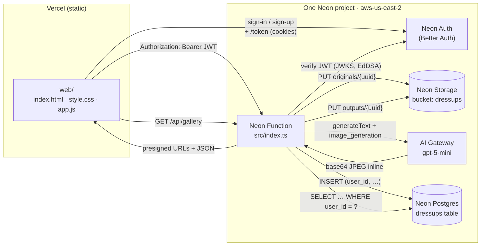

# 🐶 Doggo Dress-Up

> **Live: https://doggo-dressup.vercel.app**

Sign in, upload a photo of your dog, pick a costume, and an AI agent re-imagines them — wizard, knight, astronaut, sushi chef, disco star, and more.

A tiny app built on the **Neon backend for apps and agents** private preview, exercising every primitive in the stack:

- **[Neon Postgres](https://neon.com/docs)** — `dressups` table indexes the gallery (Drizzle schema)
- **[Neon Auth](https://neon.com/docs/neon-auth/sdk/api)** (Better Auth) — managed sign-in / sign-up, JWTs verified by JWKS
- **[Neon Functions](https://neon.com/docs/compute/functions/overview)** — single fetch handler runs the API next to the database
- **[Neon Object Storage](https://neon.com/docs/storage/overview)** — branch-scoped bucket holds the original photo + the generated image
- **[Neon AI Gateway](https://neon.com/docs/ai-gateway/overview)** — `gpt-5-mini` with the OpenAI Responses `image_generation` tool

…with the static frontend hosted on **Vercel**.


> _Same dog. Same fur pattern. Same tag on the collar. Now a wizard._

## Architecture



Every Neon piece lives on **one project, one branch**. Fork the branch and you get an isolated copy of the database, the auth users, the storage bucket, and the function — all together.

## Endpoints

The Neon Function is the entire API. CORS allows `*.vercel.app`, `*.neon.tech`, and `localhost`.

| Method | Path | Auth? | What it does |
| ------ | ---- | ----- | ------------ |
| `GET`  | `/api/auth-config` | no  | Returns the Neon Auth base URL so the SPA can discover it at runtime. |
| `GET`  | `/api/themes`      | no  | Lists the 8 built-in costumes. |
| `GET`  | `/api/me`          | optional | `{ user }` if a valid JWT is provided, else `{ user: null }`. |
| `POST` | `/api/dressup`     | **yes** | `multipart/form-data`: `photo` (file) + `theme` (id). Uploads the photo, calls the model with the photo as a visual reference + theme prompt, captures the generated JPEG, stores both in the bucket, inserts a row keyed by `user_id`, returns presigned URLs. |
| `GET`  | `/api/gallery`     | **yes** | The signed-in user's latest 24 dress-ups with fresh presigned URLs. |

Auth-protected endpoints expect `Authorization: Bearer <jwt>`. The JWT comes from `GET {NEON_AUTH_URL}/token` after sign-in (15-minute lifetime, EdDSA-signed, verified by JWKS).

## Project layout

```
.
├── neon.ts                # IaC: auth: true, AI Gateway, bucket, function
├── src/
│   ├── index.ts           # The function: routes + AI agent + S3 + Drizzle + CORS
│   ├── auth.ts            # JWT verification (jose) against the Neon Auth JWKS
│   ├── themes.ts          # The 8 costumes (knight, astronaut, wizard, …)
│   └── db/schema.ts       # Drizzle schema for the dressups table
├── web/                   # Static SPA hosted on Vercel
│   ├── index.html
│   ├── style.css
│   ├── app.js             # Auth flow (sign-in / sign-up / /token / Bearer fetch)
│   ├── vercel.json
│   └── README.md
├── drizzle.config.ts
├── package.json
└── docs/wizard-dog.jpg
```

## Run it yourself

You need access to the Neon backend-for-apps-and-agents private preview. [Sign up here.](https://neon.com/blog/were-building-backends#access)

### 1. Scaffold and link

```bash
git clone https://github.com/sav-maya/doggo-dressup.git
cd doggo-dressup
npm install

# Create a NEW Neon project in aws-us-east-2 (preview is region-locked)
neon login
neon link --project-name doggo-dressup --region-id aws-us-east-2
```

### 2. Provision and deploy the backend

```bash
neon deploy        # provisions auth + bucket + AI Gateway + deploys the function
npm run db:push    # creates the dressups table
```

`neon deploy` prints the function URL (`…compute.c-3.us-east-2.aws.neon.tech`).

### 3. Allow the frontend domain in Neon Auth

```bash
# Add your future Vercel URL(s) so Better Auth accepts cross-origin sign-in:
neon neon-auth domain add 'https://doggo-dressup.vercel.app'
```

### 4. Point the frontend at the API and deploy to Vercel

Edit [`web/app.js`](./web/app.js) and replace `API_BASE` with your function URL. Then:

```bash
cd web
npx vercel --prod
```

Add the deployment URL to Neon Auth trusted origins (step 3) if it differs from what you guessed.

### 5. Iterate locally

```bash
neon dev           # function with hot reload, env injected from the linked branch
cd web && npx serve .   # static frontend on http://localhost:3000
# Override the API base on the fly: http://localhost:3000/?api=http://localhost:8787
```

## Costumes

| Emoji | Theme |
| ----- | ----- |
| ⚔️ | Medieval Knight |
| 🚀 | Astronaut |
| 🧙 | Wizard |
| 👨‍🍳 | Chef |
| 🏴‍☠️ | Pirate Captain |
| 🤠 | Cowboy |
| 🪩 | Disco Star |
| 🍣 | Sushi Chef |

Add your own in [`src/themes.ts`](./src/themes.ts) — pure data, no other code changes needed.

## Notes

- The AI Gateway returns generated images as **base64 inline**, capped at ~640 KB per response, so the function requests `quality: 'low'` + JPEG compression. High-quality requests can blow the cap or hit the ~60s gateway timeout.
- Image-to-image runs through the OpenAI **Responses** `image_generation` built-in tool (GPT-5 family only). The uploaded photo is passed as an `image` content part on the user message; the model uses it as a visual reference when calling the tool.
- The bucket is **private**; everything that hits the browser goes through 1-hour presigned GET URLs.
- The whole app is single-region (`aws-us-east-2`) because that's the only region where the Neon backend-for-apps-and-agents preview is currently available.
- Hit a `429 REQUEST_LIMIT_EXCEEDED — daily token limit exceeded`? That's the project-level AI Gateway daily cap (a separate budget from the per-minute rate limits documented [here](https://neon.com/docs/ai-gateway/models)). Resets at the next billing window. Contact Neon support to raise it.

Built on the official [`ai-sdk` Neon template](https://build-on-neon.vercel.app/), then reskinned for dogs and given an auth gate.
