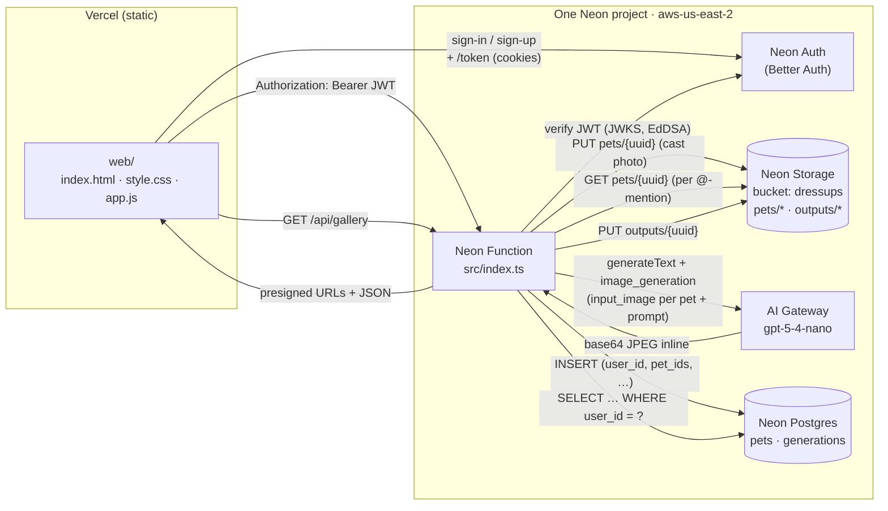

# 🐶 Doggo Dress-Up

> **Live: https://doggo-dressup.vercel.app**

Cast your dog (or any number of dogs) into any scene. Add a pet to your "cast", then @-mention them in a free-form prompt and an AI agent re-imagines them — wizards, knights, astronauts, sushi chefs, whatever you can write.

A tiny app built on the **Neon backend for apps and agents** private preview, exercising every primitive in the stack:

- **[Neon Postgres](https://neon.com/docs)** — `pets` (your cast) + `generations` (your gallery), keyed by user
- **[Neon Auth](https://neon.com/docs/neon-auth/sdk/api)** (Better Auth) — managed sign-in / sign-up, JWTs verified by JWKS
- **[Neon Functions](https://neon.com/docs/compute/functions/overview)** — single fetch handler runs the whole API next to the database
- **[Neon Object Storage](https://neon.com/docs/storage/overview)** — branch-scoped `dressups` bucket holds each pet's photo + every generated image
- **[Neon AI Gateway](https://neon.com/docs/ai-gateway/overview)** — `gpt-5-4-nano` with the OpenAI Responses `image_generation` tool

…with the static frontend on **Vercel**.


> _Same dog. Same fur pattern. Same tag on the collar. Now a wizard._

## How it works

1. **Sign up** with email + password (Neon Auth).
2. **Add your cast.** Upload a clear photo of each dog and give them a name. The slug (lowercased, alphanumeric) becomes their @-handle.
3. **Write a prompt.** Type `@` to autocomplete from your cast. e.g. _"@bowie and @rex as wizards in a starry library"_.
4. **Generate.** The function fetches each @-mentioned pet's photo from object storage, attaches it as an `input_image` content part on a `gpt-5-4-nano` Responses call alongside your prompt, runs the model's `image_generation` tool, then stores the JPEG output back to the bucket and indexes the row in Postgres.
5. **Gallery.** Every generation lands in your private gallery, scoped by user via the JWT `sub`.

## Architecture



Every Neon piece lives on **one project, one branch**. Fork the branch and you get an isolated copy of the database, the auth users, the storage bucket (with each pet's photo), and the function — all together.

## Endpoints

The Neon Function is the entire API. CORS allows `*.vercel.app`, `*.neon.tech`, and `localhost`.

| Method | Path | Auth? | What it does |
| ------ | ---- | ----- | ------------ |
| `GET`    | `/api/auth-config` | no  | Auth base URL for the SPA. |
| `GET`    | `/api/examples`    | no  | The 8 starter prompts (knight, astronaut, …). |
| `GET`    | `/api/me`          | optional | `{ user }` if a valid JWT is provided, else `{ user: null }`. |
| `GET`    | `/api/pets`        | **yes** | Your cast, with presigned photo URLs. |
| `POST`   | `/api/pets`        | **yes** | `multipart/form-data`: `name` + `photo`. Adds a pet. Slug derived from `name`. Up to 12 pets per user. |
| `DELETE` | `/api/pets/:id`    | **yes** | Removes a pet (also deletes the photo from storage). |
| `POST`   | `/api/generate`    | **yes** | `application/json`: `{ prompt }`. Parses `@slug` mentions, looks up matching pets, attaches each photo as a Responses `input_image` content part, calls `image_generation`, stores the result, returns presigned URL. |
| `GET`    | `/api/gallery`     | **yes** | Your latest 24 generations with fresh presigned URLs. |

Auth-protected endpoints expect `Authorization: Bearer <jwt>`. The JWT comes from `GET {NEON_AUTH_URL}/token` after sign-in (15-minute lifetime, EdDSA-signed, verified by JWKS).

## Project layout

```
.
├── neon.ts                # IaC: auth: true, AI Gateway, bucket, function
├── src/
│   ├── index.ts           # Function: routes + AI agent + S3 + Drizzle + CORS
│   ├── auth.ts            # JWT verification (jose) against the Neon Auth JWKS
│   ├── themes.ts          # Starter prompt examples (clickable in the UI)
│   └── db/schema.ts       # Drizzle schema: pets + generations
├── web/                   # Static SPA hosted on Vercel
│   ├── index.html         # Cast section + compose textarea + gallery
│   ├── style.css
│   ├── app.js             # Auth flow + cast CRUD + @-mention autocomplete + generate
│   ├── vercel.json
│   └── README.md
├── drizzle.config.ts
├── package.json
└── docs/wizard-dog.jpg
```

## Run it yourself

You need access to the Neon backend-for-apps-and-agents private preview. [Sign up here.](https://neon.com/blog/were-building-backends#access)

### 1. Scaffold and link

```bash
git clone https://github.com/sav-maya/doggo-dressup.git
cd doggo-dressup
npm install

# Create a NEW Neon project in aws-us-east-2 (preview is region-locked)
neon login
neon link --project-name doggo-dressup --region-id aws-us-east-2
```

### 2. Provision and deploy the backend

```bash
neon deploy        # provisions auth + bucket + AI Gateway + ships the function
npm run db:push    # creates the pets + generations tables
```

`neon deploy` prints the function URL (`…compute.c-3.us-east-2.aws.neon.tech`).

### 3. Allow the frontend domain in Neon Auth

```bash
# Add your future Vercel URL(s) so Better Auth accepts cross-origin sign-in:
neon neon-auth domain add 'https://doggo-dressup.vercel.app'
```

### 4. Point the frontend at the API and deploy to Vercel

Edit [`web/app.js`](./web/app.js) and replace `API_BASE` with your function URL. Then:

```bash
cd web
npx vercel --prod
```

Add the new Vercel URL(s) to Neon Auth trusted origins (step 3) if they differ from what you guessed.

### 5. Iterate locally

```bash
neon dev           # function with hot reload, env injected from the linked branch
cd web && npx serve .   # static frontend on http://localhost:3000
# Override the API base on the fly: http://localhost:3000/?api=http://localhost:8787
```

## Notes

- **Why `gpt-5-4-nano`?** Image generation on the gateway is locked to the GPT-5 family (it goes through OpenAI Responses' `image_generation` built-in tool). Across all gateway models the rate limits are uniform — 200K input TPM per model, 1.1M combined, 20K output TPM ([docs](https://neon.com/docs/ai-gateway/models#rate-limits)) — and there's a separate **daily account-level cap** that applies to every provider. Picking the smallest GPT-5 (`gpt-5-4-nano`) keeps the reasoning/text-token portion of each call as cheap as possible; the image bytes returned by the tool dominate output and aren't model-dependent.
- **Multi-pet scenes.** `/api/generate` attaches one `input_image` content part per @-mentioned pet, in prompt order. The agent's system prompt tells the model to use each photo as the visual reference for the corresponding `@slug`. GPT-5's image_generation tool combines them into a single scene.
- **Image size lock-in.** The Responses API only accepts `1024x1024 / 1024x1536 / 1536x1024 / auto` — there's no smaller option.
- **Inline 640 KB cap.** The gateway returns generated images base64-inline, capped at ~640 KB. The function requests `quality: 'low'` + JPEG compression to stay under it.
- **Hit a `429 REQUEST_LIMIT_EXCEEDED — daily token limit exceeded`?** That's the daily account-level cap, **not** a per-minute or per-model limit — verified by hitting the gateway with a totally different provider (`claude-haiku-4-5`) and getting the same error, and by spinning up a fresh project in the same org and hitting it instantly. Switching models or projects within the same org doesn't help; you have to wait for the window to reset or ask Neon support to raise it.
- **Bucket is private.** Every photo and every generation is served via 1-hour presigned GET URLs.
- **Single region.** The whole app is in `aws-us-east-2` because that's the only region the Neon backend-for-apps-and-agents preview supports today.

Built on the official [`ai-sdk` Neon template](https://build-on-neon.vercel.app/), then reskinned for dogs (cast → @-mention → generate).
